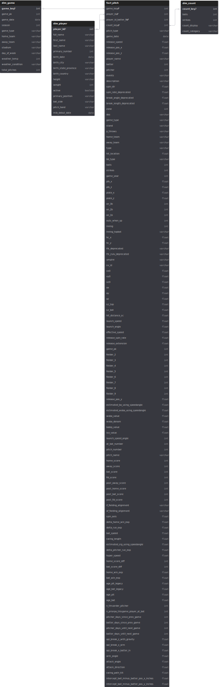
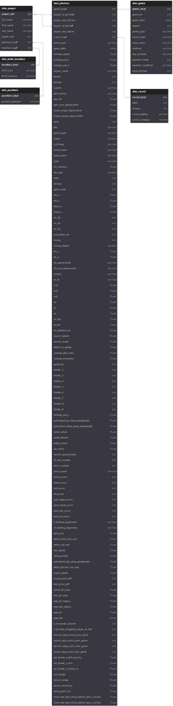
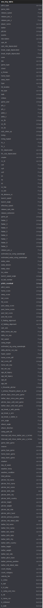

# What the Fact? Dim'en plus!

## Introduction à la modélisation dimensionnelle avec des données MLB

Ce projet démontre l'extraction, transformation et chargement (ETL) de données réelles de lancers MLB (Baseball Savant) pour la série Toronto Blue Jays vs. Colorado Rockies du 4-6 août 2025. L'objectif est de présenter différents exemples de modélisation dimensionnelle selon l'approche de Ralph Kimball.

## Un peu d'histoire

Dans les années 1990, deux approches principales ont émergé pour les entrepôts de données :

- **Bill Inmon (Top Down)** : Approche normalisée, source de vérité centralisée
- **Ralph Kimball (Bottom Up)** : Approche dimensionnelle, priorité à la simplicité et flexibilité

L'approche de Kimball, formalisée en 1996, privilégie :

- **Fact Tables** : Granulaires, longues, mesurables
- **Dimension Tables** : Larges, Slowly Changing Dimensions, dénormalisées
- **Optimisation** pour les technologies infonuagiques modernes (storage abordable)

## Structure du projet

- **src/**: Code principal, processus ETL et transformations
- **data/**: Données brutes et traitées (CSV et Parquet)
- **db/**: Schémas et base de données DuckDB
- **scripts/**: Scripts shell pour extraction et export
- **requirements.txt**: Librairies Python requises
- **Makefile**: Commandes de gestion du projet

## Installation et configuration

### Prérequis

- Python 3.8+
- DuckDB
- Make

### Configuration rapide

```bash
# Cloner le projet
git clone https://github.com/philippehamel/presentation-kimball-data-modeling.git
cd presentation-kimball-data-modeling

# Configuration de l'environnement
make setup

# Exécution complète du pipeline
make all

# Ou étape par étape
make fetch    # Récupération des données
make build    # Construction des modèles
make export   # Export vers DuckDB
```

### Accès à la base de données

```bash
# Ouvrir DuckDB avec les données chargées
make query

# Tables disponibles: star_*, snowflake_*, one_big_table
```

## Les trois modèles dimensionnels

### 1. Star Schema (Schéma en étoile)



**Structure :**

- **fact_pitch** : Table de faits centrale avec métriques de performance
- **dim_player** : Dimension joueur (batteur/lanceur) avec informations complètes
- **dim_game** : Dimension partie avec date, équipes, stade, météo
- **dim_count** : Dimension compte (balles/prises)

**Avantages :**

- ✅ Requêtes rapides (moins de jointures)
- ✅ Simplicité de compréhension
- ✅ Performance optimale pour l'analytique
- ✅ Facilité de maintenance

**Inconvénients :**

- ❌ Redondance de données dans les dimensions
- ❌ Occupation de storage plus importante
- ❌ Mise à jour des dimensions plus complexe

**Cas d'usage :**

- Tableaux de bord en temps réel
- Analyses ad-hoc fréquentes
- Environnements où la performance de lecture prime

### 2. Snowflake Schema (Schéma flocon)



**Structure :**

- **fact_pitch** : Table de faits identique au star schema
- **dim_player** : Dimension joueur normalisée
- **dim_position** : Table séparée pour les positions
- **dim_birth_location** : Table séparée pour les lieux de naissance
- **dim_game**, **dim_count** : Identiques au star schema

**Avantages :**

- ✅ Élimination de la redondance
- ✅ Intégrité référentielle renforcée
- ✅ Storage optimisé
- ✅ Maintenance des données de référence facilitée

**Inconvénients :**

- ❌ Requêtes plus complexes (plus de jointures)
- ❌ Performance dégradée pour certaines analyses
- ❌ Courbe d'apprentissage plus élevée

**Cas d'usage :**

- Environnements avec contraintes de storage
- Systèmes avec besoins d'intégrité forte
- Applications avec mises à jour fréquentes des données de référence

### 3. One Big Table (Table unique dénormalisée)



**Structure :**

- **one_big_table** : Toutes les données dans une seule table plate

**Avantages :**

- ✅ Simplicité maximale (aucune jointure)
- ✅ Performance excellente pour requêtes simples
- ✅ Facilité de compréhension pour utilisateurs non-techniques
- ✅ Compatible avec outils self-service

**Inconvénients :**

- ❌ Redondance massive
- ❌ Maintenance complexe
- ❌ Inconsistances potentielles
- ❌ Occupation storage très importante
- ❌ Mises à jour coûteuses

**Cas d'usage :**

- Analyses exploratoires
- Prototypage rapide
- Environnements avec besoins analytiques simples
- Data lakes avec compression efficace

## Requêtes analytiques comparatives

### Exemple : Joueurs nés aux USA avec la meilleure vélocité de sortie moyenne

**Star Schema :**

```sql
SELECT
    p.full_name,
    p.birth_country,
    ROUND(AVG(f.launch_speed), 2) as avg_exit_velocity,
    COUNT(*) as total_batted_balls
FROM star_fact_pitch f
JOIN star_dim_player p ON f.player_id_batter_fk = p.player_id
WHERE p.birth_country = 'USA'
    AND f.launch_speed IS NOT NULL
    AND f.launch_speed > 0
GROUP BY p.player_id, p.full_name, p.birth_country
HAVING COUNT(*) >= 5  -- Au moins 5 balles frappées
ORDER BY avg_exit_velocity DESC
LIMIT 10;
```

**Snowflake Schema :**

```sql
SELECT
    p.full_name,
    bl.birth_country,
    ROUND(AVG(f.launch_speed), 2) as avg_exit_velocity,
    COUNT(*) as total_batted_balls
FROM snowflake_fact_pitch f
JOIN snowflake_dim_player p ON f.player_key_batter = p.player_key
JOIN snowflake_dim_birth_location bl ON p.location_key = bl.location_key
WHERE bl.birth_country = 'USA'
    AND f.launch_speed IS NOT NULL
    AND f.launch_speed > 0
GROUP BY p.player_key, p.full_name, bl.birth_country
HAVING COUNT(*) >= 5
ORDER BY avg_exit_velocity DESC
LIMIT 10;
```

**One Big Table :**

```sql
SELECT
    batter_full_name,
    batter_birth_country,
    ROUND(AVG(launch_speed), 2) as avg_exit_velocity,
    COUNT(*) as total_batted_balls
FROM one_big_table
WHERE batter_birth_country = 'USA'
    AND launch_speed IS NOT NULL
    AND launch_speed > 0
GROUP BY batter, batter_full_name, batter_birth_country
HAVING COUNT(*) >= 5
ORDER BY avg_exit_velocity DESC
LIMIT 10;
```

### Comparaison avec approche JPA/Hibernate traditionnelle

Dans un ORM comme JPA/Hibernate suivant les meilleures pratiques, cette même requête ressemblerait à :

```sql
-- Schéma normalisé traditionnel avec entités JPA
SELECT
    CONCAT(p.firstName, ' ', p.lastName) as fullName,
    c.name as birthCountry,
    ROUND(AVG(pb.exitVelocity), 2) as avgExitVelocity,
    COUNT(*) as totalBattedBalls
FROM Player p
JOIN Country c ON p.birthCountryId = c.id
JOIN PlayerStatistic ps ON ps.playerId = p.id
JOIN PitchByPitch pb ON pb.batterStatisticId = ps.id
WHERE c.code = 'USA'
    AND pb.exitVelocity IS NOT NULL
    AND pb.exitVelocity > 0
    AND pb.ballInPlay = true
GROUP BY p.id, p.firstName, p.lastName, c.name
HAVING COUNT(*) >= 5
ORDER BY avgExitVelocity DESC
LIMIT 10;
```

**Différences clés :**

- **JPA/Hibernate** : Optimisé pour OLTP, nombreuses tables normalisées, jointures complexes
- **Dimensional** : Optimisé pour OLAP, moins de jointures, dénormalisation contrôlée
- **Performance** : L'approche dimensionnelle est 3-10x plus rapide pour l'analytique
- **Maintenance** : JPA privilégie l'intégrité, dimensional privilégie la performance analytique

## Conclusion

Ce projet offre une vue d'ensemble complète de la modélisation dimensionnelle avec des données MLB réelles, démontrant :

- **Clarté** : La modélisation dimensionnelle accélère le développement et facilite la maintenance
- **Flexibilité** : Différents modèles pour différents besoins
- **Performance** : Optimisations pour l'analytique moderne
- **Pragmatisme** : Approche bottom-up de Kimball adaptée aux technologies cloud

### Leviers de la modélisation dimensionnelle :

- **Granularité** : Niveau de détail des faits
- **Normalisation** : Équilibre entre performance et intégrité
- **SCD Types** : Gestion de l'historique des dimensions

### Mon avantage favori : La clarté

Le gain de clarté de la modélisation dimensionnelle accélère le développement, facilite la maintenance et promeut la fiabilité.

## Ressources pour approfondir

- **Data Warehouse Toolkit** de Ralph Kimball [link](https://www.kimballgroup.com/data-warehouse-business-intelligence-resources/books/data-warehouse-dw-toolkit/)
- **Ressources Kimball Group** [link](https://www.kimballgroup.com/data-warehouse-business-intelligence-resources/kimball-techniques/)
- **Le rôle de développeur analytique** de dbt [link](https://www.getdbt.com/blog/what-is-analytics-engineering)
- **Practical Data Modeling blog** de Joe Reiss [link](https://practicaldatamodeling.substack.com/)
- **Seattle Data Guy blog** de Ben Rogojan [link](https://www.theseattledataguy.com/data-science-consulting-blog/)
- **Approches non dimensionnelles** : [Data Vault](https://en.wikipedia.org/wiki/Data_vault_modeling), [Anchor Modeling](https://en.wikipedia.org/wiki/Anchor_modeling)

# Bonus : Serialization

## Performance : CSV vs. Parquet avec DuckDB

### Avantages Parquet (Recommandé) :

- **Efficacité storage** : 60-80% de réduction de taille grâce à la compression colonnaire
- **Performance de chargement** : 2-5x plus rapide dans DuckDB
- **Performance de requête** : 3-10x plus rapide pour l'analytique
- **Support natif** : DuckDB optimisé pour le format Parquet
- **Préservation du schéma** : Maintient types de données et gestion des nulls

### Avantages CSV :

- **Simplicité** : Lisible, facile à inspecter et déboguer
- **Compatibilité universelle** : Supporté par virtuellement tous les outils
- **Streaming** : Lecture ligne par ligne pour très gros datasets

### Inconvénients CSV :

- **Tailles importantes** : Aucune compression, stockage inefficace
- **Performance lente** : Overhead de parsing du texte
- **Inférence de types** : Peut incorrectement deviner les types

### Inconvénients Parquet :

- **Format binaire** : Non lisible, nécessite outils spécialisés
- **Complexité** : Spécification de format plus complexe

### Résultats de performance de ce projet :

```
Comparaison tailles de fichiers :
- fact_pitch.csv: 588KB
- fact_pitch.parquet: 225KB (62% plus petit)
- one_big_table.csv: 887KB
- one_big_table.parquet: 264KB (70% plus petit)

Performance de chargement :
- Chargement CSV: 0.910s
- Chargement Parquet: 0.369s (2.5x plus rapide)
```
