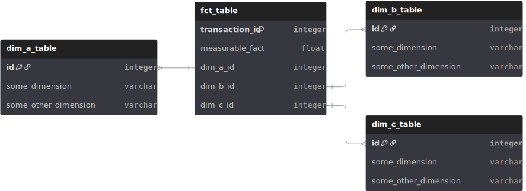

# What the Fact? Dim'en plus!
## Ou
## Introduction à la modélisation dimensionelle

  

---

# Un peu d'histoire
- ~1990 Bill Inmon formalise l'idée d'un entrepôt de donné moderne (Top Down)
  - Objectif: être une source de vérité qui représente la structure et les processus de l'entreprise 
  - Séparation de l'opérationnel et de l'analytique
  - Infrastructure optimisé pour des besoins analytique
  - Utilisation de Data Mart normalisés
  - Optimiser pour la réalité de l'époque, storage et calcul coûteux, lié et on-premise
  
- 1996 Ralph Kimball formalise sa version d'un entrepôt de donné moderne (Bottom Up)
  - Objectif: Bâtir sur la fondation de Inmon, mais prioriser la flexibilité et la simplicité
  - Formalise une approche dimensionnelle qui demande plus de storage mais moins de calcul tout en conservant la qualité des donnés et la mémoire historique
  - Hautement pratique avec la popularité des technologies infonuagique permettant d'accèder de manière flexible et abordable à de grande quantité de storage

---

# L'approche de Kimball 
## (Star Schema)

  <ul>
    <li>Fact Tables (fct_table)
      <ul>
        <li>Granulaire</li>
        <li>Longue</li>
        <li>Mesurable (habituellement)</li>
      </ul>
    </li>
  </ul>
  <ul>
    <li>Dimension Tables (dim_table)
      <ul>
        <li>Large</li>
        <li>Slowly Changing Dimensions</li>
        <li>Normalisation</li>
      </ul>
    </li>
  </ul>

  

---

# Exemple appliqué dans mon sand box préféré
## Nous allons modéliser une saison de baseball

  

---

# Méthode standard
- Choisir un processus d'affaire
- Déclarer le grain
- Identifier les dimensions
- Identifier les facts

---

# Technique fact tables
- Transactionnel
- Accumulative
- Factless
<!-- TODO write fact table by pitch -->
<!-- TODO write fact table by at-bat -->
---

# Technique dimension tables
- Normalisation
- Type de slowly changing dimensions
  - type 0
  - type 1
  - type 2
  - type 3
<!-- TODO write player dimension table scd t0, t1, t2 player transaction-->
<!-- TODO write team league affiliation to show type 3 scd-->

---

# Résultats
Exemples de requête analytique auxquelles le modèle répond :
Quelle pitch obtient le plus de "whiff" contre les batteurs gaucher?
Qui sont les leaders de coup de circuits cette semaine?
<!-- TODO write queries -->

---

# Conclusion
Star Schema n'est qu'un outils de la modèlisation dimensionnelle.
Avec l'approche dimensionnelle vous possèder plusieurs levier :
- Granularité
- Normalisation
- SCD Types

Pour optimiser les caractéristiques que vos requis demandent :
- Simplicité
- Historique
- Vélocité des requêtes
- Vélocité de l'écriture
- Storage

---

# Wow Phil c'était tellement intéressant. Mais ou en apprendre plus :
- Data warehouse toolkit de Ralph Kimball
- Ressource en ligne du Kimball Group
- Joe Reiss Practical Data Modeling blog
- Approche non dimensionelle (exemple Data Vault)
