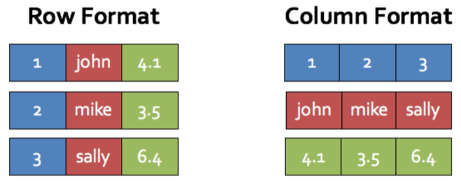
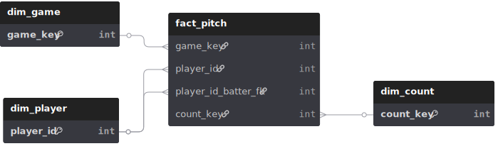
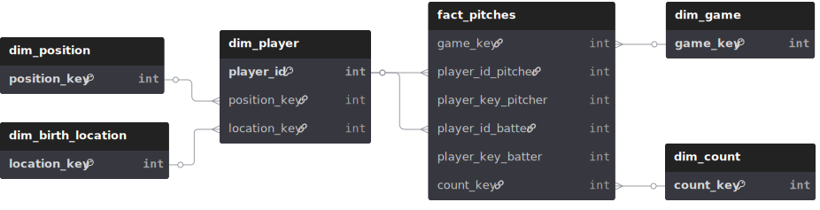

# What the Fact? Dim'en plus!

## Ou

## Introduction à la modélisation dimensionelle

  

---

# Un peu d'histoire

- ~1990 Bill Inmon formalise l'idée d'un entrepôt de donné moderne (Top Down)
  - Objectif: être une source de vérité qui représente la structure et les processus de l'entreprise
  - Séparation de l'opérationnel et de l'analytique
  - Infrastructure optimisé pour des besoins analytique
  - Utilisation de Data Mart normalisés
  - Optimiser pour la réalité de l'époque, storage et calcul coûteux, lié et on-premise
- 1996 Ralph Kimball formalise sa version d'un entrepôt de donné moderne (Bottom Up)
  - Objectif: Bâtir sur la fondation de Inmon, mais prioriser la flexibilité et la simplicité
  - Formalise une approche dimensionnelle qui demande plus de storage mais moins de calcul tout en conservant la qualité des donnés et la mémoire historique
  - Hautement pratique avec la popularité des technologies infonuagique permettant d'accèder de manière flexible et abordable à de grande quantité de storage

---

# Colonne (OLAP) VS Rangée (OLTP)

  

---

# L'approche de Kimball

## (Star Schema)

  <ul>
    <li>Fact Tables (fct_table)
      <ul>
        <li>Granulaire</li>
        <li>Longue</li>
        <li>Mesurable (habituellement)</li>
      </ul>
    </li>
  </ul>
  <ul>
    <li>Dimension Tables (dim_table)
      <ul>
        <li>Large</li>
        <li>Slowly Changing Dimensions</li>
        <li>Normalisation</li>
      </ul>
    </li>
  </ul>

  

---

# Exemple appliqué dans mon sand box préféré

## Nous allons modéliser une saison de baseball

  

---

# Méthode standard

- Choisir un processus d'affaire
- Déclarer le grain : Niveau le plus bas de détails
- Identifier les dimensions
- Identifier les facts

---

# Technique fact tables

- Transactionnel
- Accumulative
- Snapshot
- Factless

---

# Technique dimension tables

- Type de slowly changing dimensions
  - **Type 0** : Aucun changement
  - **Type 1** : Écrasement des valeurs
  - **Type 2** : Conservation de l'historique

**Exemple SCD Type 2 - Transfert de joueur :**

| Joueur       | ID     | Équipe  | Date début | Date fin   | Actif |
| ------------ | ------ | ------- | ---------- | ---------- | ----- |
| Danny Jansen | 643376 | **BOS** | 2013-06-08 | 2024-07-27 | false |
| Danny Jansen | 643376 | **TOR** | 2024-07-27 | 2100-01-01 | true  |

---

# Technique dimension tables

- Normalisation
  - **Schéma en étoile** : Dimensions dénormalisées
  - **Schéma en flocon (3NF)** : Dimensions normalisées
  - **Une grosse table** : Complètement dénormalisé

  

    <h3>Star Schema</h3>
    
    
Moins de jointures, performance optimale

  

  
  

    <h3>Snowflake Schema</h3>
    
    
Plus de jointures, intégrité renforcée

  

---

# Résultats

**Exemple : Joueurs nés aux USA avec avec la plus haute vélocité de balle frappé**

  

    <h3>Star Schema</h3>
    <pre><code>SELECT p.full_name, p.birth_country,
  ROUND(AVG(f.launch_speed), 2) as avg_exit_velocity
FROM star_fact_pitch f
JOIN star_dim_player p 
  ON f.player_id_batter_fk = p.player_id
WHERE p.birth_country = 'USA'
  AND f.launch_speed > 0
GROUP BY p.player_id, p.full_name, p.birth_country
HAVING COUNT(*) >= 5
ORDER BY avg_exit_velocity DESC LIMIT 10;</code></pre>
  

  
  

    <h3>Snowflake Schema</h3>
    <pre><code>SELECT p.full_name, bl.birth_country,
  ROUND(AVG(f.launch_speed), 2) as avg_exit_velocity
FROM snowflake_fact_pitches f
JOIN snowflake_dim_player p 
  ON f.player_key_batter = p.player_key
JOIN snowflake_dim_birth_location bl 
  ON p.location_key = bl.location_key
WHERE bl.birth_country = 'USA'
  AND f.launch_speed > 0
GROUP BY p.player_key, p.full_name, bl.birth_country
HAVING COUNT(*) >= 5
ORDER BY avg_exit_velocity DESC LIMIT 10;</code></pre>
  

---

# One Big Table

**Même exemple : Simplicité maximale, aucune jointure**

  

    <h3>One Big Table</h3>
    <pre><code>SELECT batter_full_name, batter_birth_country,
  ROUND(AVG(launch_speed), 2) as avg_exit_velocity,
  COUNT(*) as total_batted_balls
FROM one_big_table
WHERE batter_birth_country = 'USA'
  AND launch_speed IS NOT NULL
  AND launch_speed > 0
GROUP BY batter, batter_full_name, batter_birth_country
HAVING COUNT(*) >= 5
ORDER BY avg_exit_velocity DESC 
LIMIT 10;</code></pre>
  

---

# Conclusion

Star Schema n'est qu'un outils de la modèlisation dimensionnelle.
Avec l'approche dimensionnelle vous possèder plusieurs levier :

- Granularité
- Normalisation
- SCD Types

Pour optimiser les caractéristiques que vos requis demandent :

- Simplicité
- Historique
- Vélocité des requêtes
- Vélocité de l'écriture
- Storage

---

# Mon avantage Favoris

## Clarté

Le gain de clarté de la modèlisation dimensonnielle, accélère le développement, facilite la maintenance et promeut la fiabilité.

---

# Wow Phil c'était tellement intéressant, mais où en apprendre plus?

  

- Data warehouse toolkit de Ralph Kimball et ressource en ligne du Kimball Group
- Joe Reiss Practical Data Modeling blog
- Seattle Data Guy blog
- Approche non dimensionelle (exemple Data Vault ou Anchor)
