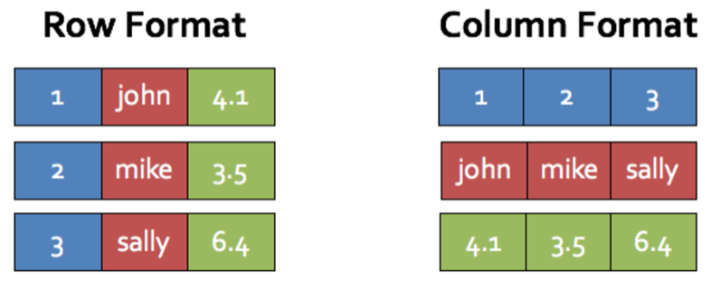
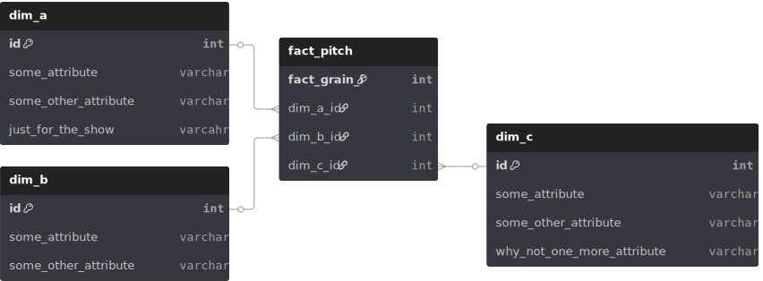
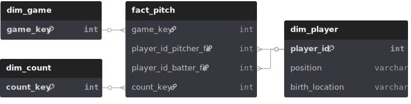
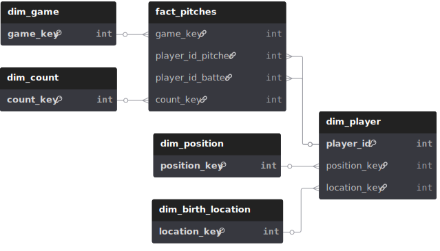

# What the Fact? Dim'en plus!

## Ou

## Introduction à la modélisation dimensionelle

  

---

# Pourquoi?

## Être capable de répondre a des questions analytique du genre :

- Quelle est la moyenne de vente pour nos utilisateurs a Montréal?
- Sur quelle catégorie de produits a eu la meilleure croissance de revenue pendant le dernier quart financier?
- Quelles sont les joueurs née au USA qui ont frappé la balle avec le plus de vélocité pendant la dernière série de 3 matchs entre les Blue Jays et les Rockies?

---

# Rangée (OLTP) VS Colonne (OLAP)

  

---

# L'approche de Kimball

## Deux composantes importantes :

1. fact table (préfixe fct\_)
2. dimension table (préfixe dim\_)

  

---

# Exemple appliqué dans mon sand box préféré

## Nous allons modéliser une saison de baseball

  

---

# Méthode standard

- Choisir un processus d'affaire: Performance des joueurs
- Déclarer le grain: Niveau le plus bas de détails
- Identifier les dimensions: Attributs descriptifs utilisés pour filtrer, grouper et étiqueter
- Identifier les facts: Mesures quatitatives

---

# Technique fact tables

- Transactionnel: chacun des lancers
- Accumulative: présence au bâton ou match
- Snapshot: positionnement dans le classement à chaque semaine

---

# Technique dimension tables

- Slowly changing dimension sont des dimensions dont les attributs évoluent lentement au fil du temps
  - **Type 0** : Aucun changement
  - **Type 1** : Écrasement des valeurs
  - **Type 2** : Conservation de l'historique

**Exemple SCD Type 2 - Transfert de joueur :**
| Joueur       | ID     | Équipe  | Date début | Date fin   | Actif |
| ------------ | ------ | ------- | ---------- | ---------- | ----- |
| Danny Jansen | 643376 | **TOR** | 2018-08-15 | 2100-01-01 | true|

devient:

| Joueur       | ID     | Équipe  | Date début | Date fin   | Actif |
| ------------ | ------ | ------- | ---------- | ---------- | ----- |
| Danny Jansen | 643376 | **TOR** | 2018-08-15 | 2024-07-27 | false |
| Danny Jansen | 643376 | **BOS** | 2024-07-27 | 2100-01-01 | true  |

---

# Technique dimension tables

- Normalisation
  - **Schéma en étoile** : Dimensions dénormalisées
  - **Schéma en flocon (3NF)** : Dimensions normalisées
  - **Une grosse table** : Complètement dénormalisé

  

    <h3>Star Schema</h3>
    
    
Moins de jointures, meilleure vélocité des requêtes

  

  
  

    <h3>Snowflake Schema</h3>
    
    
Plus de jointures, meilleure performance de stockage

  

---

# Résultats

**Exemple : Joueurs nés aux USA avec avec la plus haute vélocité de balle frappé**

  

    <h3>Star Schema</h3>
    <pre><code>SELECT p.full_name, p.birth_country,
  ROUND(AVG(f.launch_speed), 2) as avg_exit_velocity
FROM star_fact_pitch f
JOIN star_dim_player p 
  ON f.player_id_batter_fk = p.player_id
WHERE p.birth_country = 'USA'
  AND f.launch_speed > 0
GROUP BY p.player_id, p.full_name, p.birth_country
HAVING COUNT(*) >= 5
ORDER BY avg_exit_velocity DESC LIMIT 10;</code></pre>
  

  
  

    <h3>Snowflake Schema</h3>
    <pre><code>SELECT p.full_name, bl.birth_country,
  ROUND(AVG(f.launch_speed), 2) as avg_exit_velocity
FROM snowflake_fact_pitches f
JOIN snowflake_dim_player p 
  ON f.player_key_batter = p.player_key
JOIN snowflake_dim_birth_location bl 
  ON p.location_key = bl.location_key
WHERE bl.birth_country = 'USA'
  AND f.launch_speed > 0
GROUP BY p.player_key, p.full_name, bl.birth_country
HAVING COUNT(*) >= 5
ORDER BY avg_exit_velocity DESC LIMIT 10;</code></pre>
  

---

# One Big Table

**Même exemple : Simplicité maximale, aucune jointure**

  

    <h3>One Big Table</h3>
    <pre><code>SELECT batter_full_name, batter_birth_country,
  ROUND(AVG(launch_speed), 2) as avg_exit_velocity,
  COUNT(*) as total_batted_balls
FROM one_big_table
WHERE batter_birth_country = 'USA'
  AND launch_speed IS NOT NULL
  AND launch_speed > 0
GROUP BY batter, batter_full_name, batter_birth_country
HAVING COUNT(*) >= 5
ORDER BY avg_exit_velocity DESC 
LIMIT 10;</code></pre>
  

---

# Conclusion

Avec l'approche dimensionnelle vous possèder plusieurs levier :

- Granularité
- Normalisation
- SCD

Pour optimiser les caractéristiques que vos requis demandent :

- Clarté pour les utilisateurs
- Fiabilité historique
- Vélocité des requêtes
- Vélocité de l'écriture
- Minimiser le stockage

---

# Mon avantage favori

## Clarté

Le gain de clarté de la modèlisation dimensonnielle, accélère le développement, facilite la maintenance et promeut la fiabilité.

  

---

# Wow Phil c'était tellement intéressant, mais où en apprendre plus?
- Data warehouse toolkit de Ralph Kimball et ressource en ligne du Kimball Group
- Joe Reiss Practical Data Modeling blog
- Ben Rogojan Seattle Data Guy blog
- Approche non dimensionelle (exemple Data Vault ou Anchor)

  

---

  

